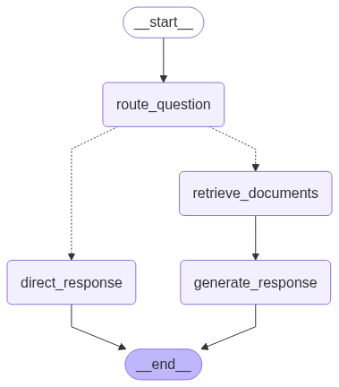

# LangGraph Demo

A RAG AI Agent demo using LangGraph for intelligent question answering.

https://github.com/user-attachments/assets/9bc8faed-9544-4485-9604-cda69c6ce206

## Architecture



The application uses an intelligent routing workflow:

1. **Question Routing**: Analyzes incoming questions to determine the appropriate response strategy
2. **Document Retrieval**: Searches ChromaDB vector store for relevant documents
3. **Direct Response**: Provides immediate answers for simple, general questions
4. **Response Generation**: Generates contextual responses using retrieved documents and OpenAI's GPT-4o-mini

### Key Components

- **Vector Store**: ChromaDB with OpenAI embeddings
- **LLM**: OpenAI GPT-4o-mini for response generation
- **Graph Engine**: LangGraph for orchestrating the RAG workflow
- **State Management**: Typed state handling for messages and documents

## Prerequisites

### For Docker Compose (Recommended)

- Docker and Docker Compose
- OpenAI API key
- LangSmith API key

### For Kubernetes (Minikube)

- Docker
- Minikube
- kubectl
- Helm 3.x
- OpenAI API key
- LangSmith API key

### For Local Development

- Python 3.13+
- OpenAI API key
- UV package manager

## Getting Started

### Quick Start with Docker Compose

Start with Docker Compose:

1. **Create environment file**:

   ```bash
   cp .env.example .env
   # Edit .env file with your API keys:
   # OPENAI_API_KEY (required)
   # LANGSMITH_API_KEY (required)
   ```

2. **Start all services**:

   ```bash
   make docker_up
   ```

   This starts the following services:

   - API Server: RAG agent (port 8123)
   - PostgreSQL: Stores conversation data and manages background tasks (port 5433)
   - Redis: Enables real-time streaming of agent responses (port 6379)

3. **Generate AWS documentation index for RAG (one-time setup)**:

   ```bash
   make gen_index
   ```

4. **Access the application**:
   - API: <http://localhost:8123>
   - LangGraph Studio: <https://smith.langchain.com/studio/?baseUrl=http://localhost:8123>
   - Agent Chat UI: <https://agentchat.vercel.app/?apiUrl=http://localhost:8123&assistantId=agent>

### Quick Start with Minikube

Deploy to local Kubernetes cluster:

1. **Start minikube**:

   ```bash
   minikube start
   ```

2. **Set the required environment variables**:

   ```bash
   export OPENAI_API_KEY="your-openai-api-key"
   export LANGSMITH_API_KEY="your-langchain-api-key"
   ```

3. **Build and deploy**:

   ```bash
   # Build image in minikube's docker environment
   eval $(minikube docker-env)
   make k8s_build
   
   make k8s_deploy
   ```

4. **Generate AWS documentation index for RAG (one-time setup)**:

   ```bash
   make k8s_gen_index
   ```

5. **Access the application**:

   ```bash
   make k8s_port_forward
   ```

   - API: <http://localhost:8123>
   - LangGraph Studio: <https://smith.langchain.com/studio/?baseUrl=http://localhost:8123>
   - Agent Chat UI: <https://agentchat.vercel.app/?apiUrl=http://localhost:8123&assistantId=agent>

6. **Clean up**:

   ```bash
   make k8s_clean
   ```

### Local Development

#### Installation

Installing dependencies:

```bash
make install
```

#### Configuration

Create `.env` file:

```env
# Required LLM Token
OPENAI_API_KEY="your_openai_api_key_here"

# Required for LangGraph Server Docker deployment
# LANGSMITH_API_KEY="your_langsmith_api_key_here"

# Optional: Additional LangSmith configuration for tracing
# LANGSMITH_PROJECT="LANGGRAPH-DEMO"
# LANGSMITH_TRACING_V2=true
```

#### Development

Start the AI agent in developer mode:

```bash
make dev
```

This launches LangGraph Studio - a visual debugging interface for testing and monitoring your RAG agent.

## Project Structure

```text
├── src/
│   ├── agent/
│   │   ├── graph.py       # Main RAG workflow
│   │   ├── state.py       # State management
│   │   └── prompts.py     # LLM prompts
│   └── tools/
│       └── indexer.py     # Document indexing utilities
├── tests/
│   ├── unit_tests/        # Unit tests
│   └── integration_tests/ # Integration tests
├── deployment/
│   └── docker/            # Docker deployment configurations
├── data/                  # Vector store data
├── Makefile               # Development commands
└── langgraph.json         # LangGraph configuration
```

## Development Commands

The Makefile provides convenient development, testing, and deployment commands.

```bash
# Development
make install      # Install dependencies
make dev          # Start LangGraph development server
make clean        # Clean build artifacts

# Testing
make test         # Run unit tests
make lint         # Run code quality checks
make format       # Auto-format code

# Docker
make docker_up    # Start all services
make docker_down  # Stop services

# Kubernetes
make k8s_build    # Build Docker image
make k8s_deploy   # Deploy to Kubernetes
make k8s_clean    # Clean up deployment
```
